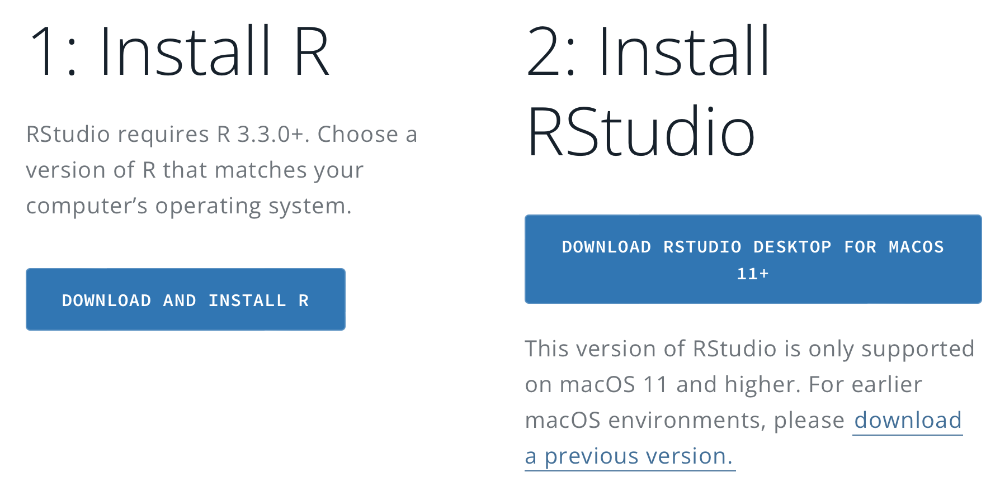

# Installation notes

## Overview

The main applications for the workshop are
- RStudio
- git

Please have both installed prior to the workshop, using the instructions below if needed.

R is a programming language designed for statistical computation. RStudio is a popular third party "integrated development environment" (IDE) that runs on top of R, and provides a text editor, file and package manager, help system, console, and more. Both are open source and free.

*BIOL-0495e will be taught using R, and you should be able to use the same installation, including RStudio, for the course.*

Git is by far the most widely used "version control system" (VCS) for code and other documents. While it is not required for BIOL-0495e, it is good practice to learn how to use it for your projects and for collaboration.

[GitHub](https://github.com) is a private company that provides hosting for sharing of git repositories, or "repos" (along with many other services for software developers). In practice, most hosted git repos are on GitHub, although the tool git and the service GitHub are not formally connected (and there are open source alternative hosting services like [GitLab](https://about.gitlab.com)).  Free-tier GitHub hosting is sufficient for most scientific users.

*Note: if you already have working versions of RStudio and/or git, skip the instructions below. However, you should update if you are using substantially old versions.*

## R and RStudio installation

To install RStudio, go to https://posit.co/download/rstudio-desktop/. You should see something similar to

where the website should detect your operating system and provide a compatible RStudio link for Step 2.

For reasons, you must **first** install R by going to the [CRAN](https://cran.rstudio.com) page (link in the Step 1 button). At the top of that page you should see a box "Download and Install R"; please follow the instructions appropriate for your operating system. You should need only the main package (e.g. `R 4.3.2 binary for macOS`), not any of the links lower on the page.

Once R is installed, return to Step 2 and follow instructions to install RStudio.

You may want to skim the [RStudio User's Guide](https://docs.posit.co/ide/user/ide/get-started/) for background, but it is not required for the workshop or course.

## Git installation

There are many ways to install and use git, including command line tools, IDE extensions, and dedicated GUI tools. It is enough to choose just one of the options below; git repos can be passed between all the different tools, so you can choose a different interface later if you want.

### GitHub account

You must make an account at [GitHub](https://github.com) to be able to "push" (upload) code to their website and contribute to projects, but not to read public repos, such as for this workshop. An account is needed no matter which type of git interface you use if you plan to use their service.

### GitHub Desktop

A simple but somewhat restricted option is to install the standalone application [GitHub Desktop](https://desktop.github.com) from GitHub. The GUI is intended to interact closely with their hosting service, but can also be used purely locally, and in principle also with other hosting services. Some users find the graphical interface easier to use than the command line, especially for things like inspecting differences between code versions.

GitHub also offers their own specialized [command line interface](https://cli.github.com).

### Git-SCM community

General git information can be found at [https://git-scm.com](https://git-scm.com), including installation instructions for different OS. Before attempting to install, check if you already have git, for example on Mac or Linux by typing in a terminal:
```shell
which git
```
If a path string is returned, you already have git on your computer.

Direct links for interface options and different OS:
- Linux: https://git-scm.com/download/linux
- Mac: https://git-scm.com/download/mac
- Windows: https://git-scm.com/download/win
- GUIs: https://git-scm.com/downloads/guis
- Getting started docs: https://git-scm.com/book/en/v2/Getting-Started-Installing-Git

### Xcode on Mac

For **Mac**, `git` is included with the free Apple developer suite `Xcode`, which can be installed from the App Store. This can take a long time; `Xcode` is a massive package with a lot of tools you would need only if you start developing for Apple products. However, this is the "native" approach, and will provide automatic updates. If you would rather have a leaner install of just `git`, use the links above.

## Python

**This workshop will not use python**. However, python is very popular for scientific analysis in general, and particularly dominant in machine learning, so I provide information here for completeness.

I suggest the [Anaconda distribution](https://www.anaconda.com/products/distribution) as a good starting place for learning to use python for scientific analysis. There are leaner ways to install python, but for most scientists the convenience is more important than the size of the distribution.

Installing Anaconda will also install `conda`, which handles package management and virtual environments.

- Note: The most popular `conda` alternative is a combination of `venv` and `pip`, which are part of most python installs. Either choice is likely to work for most users; however, they don't always play nice together, and I **strongly recommend against mixing `conda` and `pip`**. If you must use both, generally it is better to first do everything you can with `conda`, and use `pip` only at the end of package installation.

Anaconda Navigator is an app that comes with their distribution, but is not necessary to use it for python programming. You may or may not prefer the GUI interface to a command line interface for new projects.
